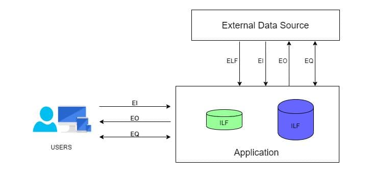

## Functional point analysis

FPA is technique used to measure software requirements bsaed on different functions , assigning points to each and summarizing them to estimate the total man-hours required for the project 

### Compnents of FPA 
FPA involves categorizing system interactions into five types : 

#### External Inputs (EI) 
- These are user inputs that are processed and stored within the system 
> add item shopping cart and ordering it
#### External Outputs (EO)
- These are data being sent out from the system to an external user of system
> sending order conformation email 
#### External Queries (EQ)
- This involves both input and output
> searching an item (input) and get search results back (output)
#### External Logic Files (EFL)
- The external data used by the system for reference or additional functionality
> Getting review of a product from third-party services
#### Internal Logic Files (IFL)
- A collection of interrelated data managed by the system
> The database storing all the items, user data , order history

### Benefits of Functional point analysis 

### FP Points Computation
- Calculate unadjusted functional points ( `UFP` )
    - know the weighing factors (Low, Average, High)
    - multiply component values with weights and finally add them all 
    - the result of that sum above is the UFP values
- Calculate comkplexity adjustment factor 
    - know the adjustment factor value
        - 0 : Not important
        - 1 : Incidental 
        - 2 : Moderate 
        - 3 : Average
        - 4 : Significant
        - 5 : Essential
    - multiply the adjustment factor value with len(general system characteristics) (usually 14)
    - $CAF = 0.65 + (0.01 \times \sum{F_i})$ => $F_i = 14 \times \text{adjustment factor value}$

Final Formula : $FP = UFP \times CAF$

### General System characteristics (GSC's)
following questions:
1. Does the system require reliable backup and recover.
2. Are data communications required?
3. Are there distributed processing functions?
4. Is performance critical?
5. Will the system run in an existing, heavily utilized operational environment?
6. Does the system require on-line data entry?
7. Does the on-line data entry require the input transaction to be built over multiple screens or operations?
8. Are the master files updated on-line?
9. Are the inputs, outputs, files, or inquiries complex?
10. Is the internal processing complex?
11. Is the code designed to be reusable?
12. Are conversion and installation included in the design?
13. Is the system designed for multiple installations in different organizations?
14. Is the application designed to facilitate change and ease of use by the user?
### Example

1. **Table of Weights for FPA Components**:

   | Component        | Low Complexity | Average Complexity | High Complexity |
   |------------------|----------------|--------------------|-----------------|
   | External Inputs  | 3              | 4                  | 6               |
   | External Outputs | 4              | 5                  | 7               |
   | External Inquiries| 3              | 4                  | 6               |
   | Internal Logic Files (ILF) | 7    | 10                 | 15              |
   | External Logic Files (ELF) | 5    | 7                  | 10              |

2. **Simplified Example for Calculation**:

   Let's assume we have the following counts for each component:
   - External Inputs: 2 of low complexity
   - External Outputs: 1 of average complexity
   - Inquiries: 2 of high complexity
   - Internal Logic Files: 1 of high complexity
   - External Logic Files: 1 of low complexity

   The calculation would be:
   - External Inputs: 2 × 3 = 6
   - External Outputs: 1 × 5 = 5
   - Inquiries: 2 × 6 = 12
   - Internal Logic Files: 1 × 15 = 15
   - External Logic Files: 1 × 5 = 5

   Total Unadjusted Function Points (UFP) = 6 + 5 + 12 + 15 + 5 = 43

Let's say that the 14 General System Characteristics (GSCs) each have an arbitrary value of 3 for simplicity. The sum of the GSCs would be 3 × 14 = 42.

Using the formula for the Complexity Adjustment Factor (CAF):
$ CAF = 0.65 + (0.01 \times \sum{E_i}) $
$ CAF = 0.65 + (0.01 \times 42) $
$ CAF = 0.65 + 0.42 $
$ CAF = 1.07 $

Now, calculate the final Function Points (FP) using the UFP from before:
$ FP = UFP \times CAF $
$ FP = 43 \times 1.07 $
$ FP = 46.01 $

So, the total Function Points, adjusted for complexity with this CAF, would be approximately 46.

## SLOC
**Source Lines Of Code** is a software metric used to measure the size of a software program by counting the number of lines in the program's source code.

SLOC is typically used to determine the amount of effort that will be required to develop a program, as well as programming productivity and effort once the software is produced

### Types of SLOC

#### Physical SLOC 
> Physical SLOC calculates total number of lines a source code including inline comments , blank lines etc... 
> - it is easier to measure but very sentitive to coding conventions and code formatting

#### Logical SLOC 
> Logical SLOC only calculates executable code expressions (such as operators, functions, etc...)
> - while Logical SLOC is less effective to code formatting, it is hard to measure.

### Advantages 

> [!FAQ]- Are callouts foldable?
> Yes! In a foldable callout, the contents are hidden until it is expanded.

