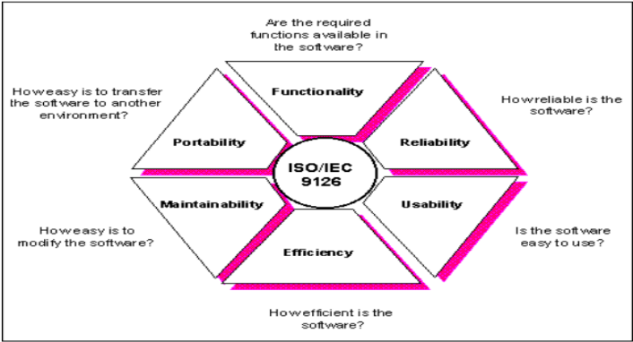

## Planning Quality 
Planning quality in Strategic Project Management (SPM) is crucial for delivering successful projects. Here's a simplified guide:

1. **Define Objectives and Scope**: Clearly outline the project's goals and what it does not include.
2. **Engage Stakeholders**: Involve important stakeholders early, understanding their needs and expectations.
3. **Create a Project Charter**: Draft a document detailing the project's purpose, objectives, stakeholders, and main constraints.
4. **Set Quality Policy and Objectives**: Develop a policy for overall quality expectations and specific objectives aligned with the project's goals.
5. **Develop a Quality Plan**: Create a detailed plan for managing quality, including standards, processes, tools, and roles.
6. **Assess Risks**: Identify potential risks to quality and plan how to address them.
7. **Allocate Resources**: Ensure you have the right people, materials, and technology to meet quality standards.
8. **Establish Quality Standards and Metrics**: Define specific, measurable standards and metrics to assess the project's deliverables.
9. **Quality Assurance**: Set up ongoing processes like reviews and audits to maintain quality standards.
10. **Quality Control**: Monitor work to ensure it meets quality standards and fix any issues.
11. **Promote Continuous Improvement**: Encourage the team to give feedback and learn from experiences to improve quality processes.
12. **Keep Detailed Records**: Document all quality-related activities, like inspections and tests.
13. **Communicate Effectively**: Keep all stakeholders informed about quality expectations and progress.
14. **Train the Team**: Offer training for the team to improve their quality management skills.
15. **Manage Changes Carefully**: Handle any changes in the project systematically to reduce their impact on quality.
16. **Validate and Verify**: Check that the project's outcomes meet the set quality criteria.
17. **Evaluate at Closure**: At the project's end, assess the quality results, noting any deviations or lessons.
18. **Measure Customer Satisfaction**: Get feedback from stakeholders and customers on the project's quality.

Following these steps throughout the project lifecycle helps ensure high quality and meets stakeholder expectations.

## ISO 9126
Quality is software is not just about what the software does which is functionality specification, but also about quality specification and resource specification that is how well the software performs and the resources allocation.

software system are complex and require maintenance, and users expect high quality, which can be challending to measure and assure. 

- **ISO/IEC 9126 Standard Details**: It breaks down software quality into specific characteristics and sub-characteristics, offering metrics to evaluate them. It's versatile and can be tailored for different software types.

- **Six Key Quality Characteristics**: 
  1. **Functionality**: How well the software performs its intended tasks.
        - includes suitability, accuracy, interoperability, compliance, and security.
  2. **Efficiency**: The software's performance in terms of resource usage and speed.
        - covers time behavior, resource utilization, and efficiency compliance.
  3. **Maintainability**: How easily the software can be modified and maintained.
        - includes analyzability, changeability, stability, testability, and maintainability compliance.
  4. **Reliability**: The software's ability to function consistently and accurately.
        - includes maturity, fault tolerance, recoverability, and reliability compliance.
  5. **Usability**: How user-friendly and easy to understand the software is.
        - involves understandability, learnability, operability, attractiveness, and usability compliance.
  6. **Portability**: The ease with which the software can be transferred to different environments.
        - encompasses adaptability, installability, co-existence, replaceability, and portability compliance

  

- **Three Parts of ISO 9126**: 
  1. **ISO/IEC 9126-1**: Focuses on defining the quality characteristics and their sub-characteristics.
  2. **ISO/IEC 9126-2**: Deals with external metrics for evaluating software quality.
  3. **ISO/IEC 9126-3**: Concentrates on internal metrics for quality assessment.

ISO 9126 provides a comprehensive framework to define and assess the quality of software, ensuring clear communication between customers and developers and aiming to meet user expectations effectively.